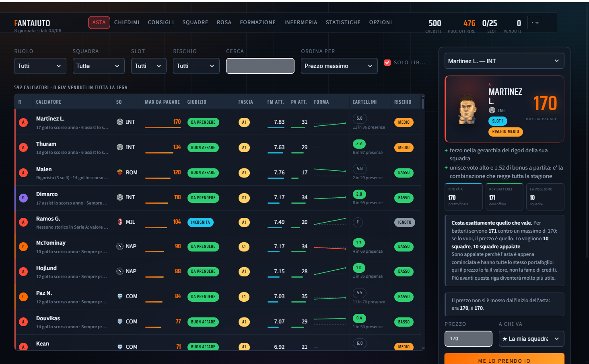

# FantAiuto

## Webapp GitHub Pages

La versione web è una SPA statica: il punto d'ingresso è [`index.html`](index.html)
e funziona senza backend. Legge il dataset presente in `dati/valutazioni.json` e
salva acquisti, squadre, tema e impostazioni nell'IndexedDB del browser.

Per provarla in locale:

```bash
python -m http.server 8765
```

Poi apri `http://127.0.0.1:8765/`. Su GitHub Pages viene servita direttamente dalla
cartella principale del repository; i dati sono una fotografia statica e cambiano
solo quando viene pubblicata una nuova versione del dataset.

Assistente per l'asta e per la formazione del fantacalcio, con i dati ufficiali di
fantacalcio.it aggiornati da soli ogni ora.

Non è un listone con sopra una tabella: è un motore che stima quanto rende ogni
giocatore, quanto costerà davvero, e **a quanto verrà battuto** — perché in un'asta al
rialzo il prezzo non lo fa chi vince, lo fa il secondo.



## Cosa fa

| | |
|---|---|
| **Asta** | 592 calciatori con prezzo massimo consigliato, ricalcolato a ogni acquisto segnato: quando qualcuno strapaga un difensore, un secondo dopo i prezzi degli altri difensori sono cambiati e te lo dice |
| **Chiedimi** | Le domande dell'asta scritte come vengono: *quanto vale Dimarco*, *posso arrivare a 90 su Lautaro*, *cosa mi manca*, *come sta andando l'asta* |
| **Consigli** | Sei rose costruite con sei idee diverse, ognuna con quanto costa preferirla in punti; i blocchi difensivi a quattro prezzi; le scommesse reparto per reparto |
| **Formazione** | Per ogni modulo prova tutte le combinazioni di portiere e difensori e tiene quella che rende di più **modificatore compreso** |
| **Statistiche** | Quattro stagioni, diciassette classifiche, cartellini, scomposizione della fantamedia |

## Come funziona il motore

**Il valore** non è la fantamedia: è quanto un giocatore rende **sopra il sostituto** che
prenderesti comunque a un credito nel suo ruolo, moltiplicato per le partite che ci si
aspetta giochi. È il motivo per cui un difensore da 7.1 di fantamedia può valere più di
un attaccante da 7.8: il difensore medio è molto più scarso dell'attaccante medio.

**I prezzi si muovono** durante l'asta. I crediti ancora vivi nella lega vengono
ridistribuiti fra i reparti in proporzione al valore rimasto sul mercato e a quanto la
lega sta pagando quel reparto rispetto ai consigli — su tre livelli: tutta la lega, il
ruolo, la singola fascia.

**Il prezzo di aggiudicazione** guarda i portafogli veri degli avversari: chi ha ancora
una casella libera in quel ruolo, quanti crediti ha in mano, fin dove può spingersi. Da
lì escono due numeri diversi: *quanto vale per te* e *quanto devi mettere per batterli*.

**Gli expected goals** distinguono la fortuna dal merito: chi ha segnato cinque gol su
tre occasioni vere sta per tornare sulla terra, chi ne ha costruite dieci senza segnare
sta per esplodere.

## Le fonti

| Cosa | Da dove |
|---|---|
| Listone, quotazioni, statistiche di quattro stagioni, voti | fantacalcio.it |
| Probabili formazioni, ballottaggi, infortuni con data di rientro | SosFanta |
| Seconda quotazione di mercato indipendente | Fantapazz |
| Gol attesi, minuti veri, xGChain | Understat |
| Gerarchie di rigoristi e calci piazzati | fantacalcio.it |

Tutto viene scaricato e rielaborato in locale. Nessun servizio a pagamento, nessuna
chiave, nessun account.

## Come si usa

```bash
python aggiorna.py                   # scarica i dati e ricalcola (~1 minuto)
python -m streamlit run app.py       # apre nel browser
pythonw avvia.py                     # apre nella sua finestra, senza browser
```

Su Windows `installa.ps1` lo installa nel menu Start e registra l'aggiornamento
automatico ogni ora. `portatile.spec` + `confeziona.py` producono una versione
eseguibile che gira senza Python.

## I collaudi

```bash
python prove.py
```

117 controlli che non si limitano a chiedere se il programma parte: verificano che i
prezzi restino nel mondo reale, che nessuno paghi più di quanto ha in tasca, che
strapagare un difensore muova soprattutto i difensori, che i colori si leggano in
entrambi i temi, e che ogni consiglio abbia una ragione scritta accanto.

## Com'è fatto dentro

```
app.py             l'interfaccia (Streamlit)
mercato.py         i conti che cambiano durante l'asta: calibrazione, prezzi, scarsità
fanta_modello.py   il motore: rendimento atteso, rischio, valore, prezzi consigliati
strategia.py       il ragionamento d'asta: le sei rose, i blocchi, le scommesse
consulente.py      l'interprete delle domande della pagina Chiedimi
giudizio.py        il parere su ogni giocatore, con le sue ragioni
statistiche.py     le classifiche e la scomposizione della fantamedia
tema.py            il sistema visivo: palette, movimento, componenti
fanta_*.py         gli scaricatori, una fonte per file
```

Il codice è commentato in italiano e spiega **perché**, non cosa: i commenti raccontano
le decisioni e gli errori che le hanno causate.

## Licenza

Uso personale.
